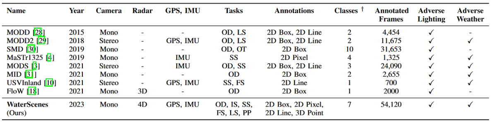

# Surface Datasets

1. [MaSTr1325](https://box.vicos.si/borja/viamaro/index.html)
      - Inputs: Images & Imu
      - Annotations: 2D Mask(Semantic)
2. [MODD2](https://box.vicos.si/borja/viamaro/index.html)
      - Inputs: Images & Imu
      - Annotations: 2D Bounding Boxes
3. [MODS](https://box.vicos.si/borja/viamaro/index.html)
      - Inputs: Images & Imu
      - Annotations: 2D Bounding Boxes
4. [USVInland](https://orca-tech.cn/datasets/USVInland/Introduction)
      - Inputs: Images
      - Annotations: 2D Depth / 2D Mask(Semantic)
5. [FloW](https://orca-tech.cn/datasets/FloW/Introduction)
      - Inputs: Images & 3D Radar Point Clouds
      - Annotations: 2D Bounding Boxes / Point Clouds Annotations(Semantic)
6. [WaterScenes](https://waterscenes.github.io/)
      - Inputs: Images & 4D Radar Point Clouds
      - Annotations: 2D Bounding Boxes / 2D Mask(Semantic) / Point Clouds Annotations(Semantic)

