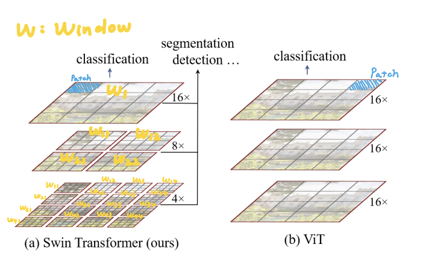
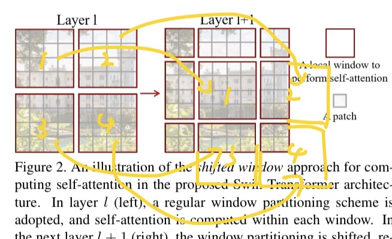
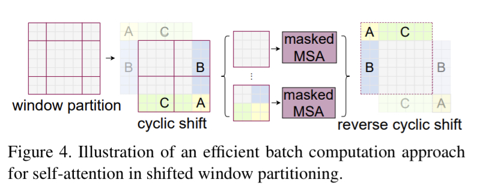
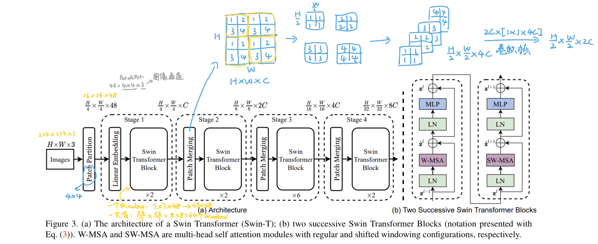
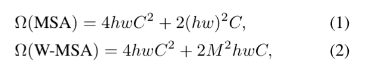
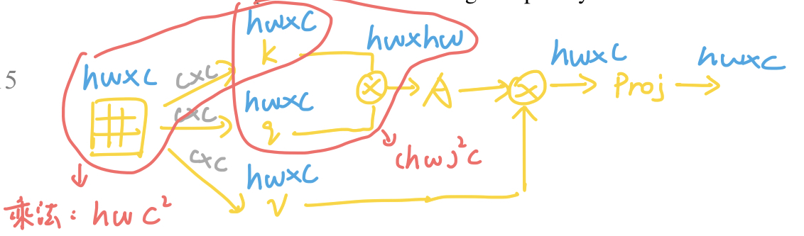
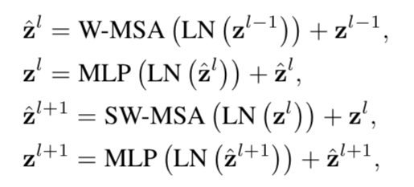

# Swin Transformer

论文名：Swin Transformer: Hierarchical Vision Transformer using Shifted Windows

## 1.论文思路

- 相比于 [ViT](ViT.md) 模型直接对全图做注意力机制，Swin Transformer 选择将整张图划分成一个个 **Window**，在 **Window** 里面做注意力机制
- 与 ViT 相同的是，Swin Transformer 同样将图像划分成一个个 **Patch**，只不过在每一层 Transformer 中的 **Patch** 大小不太一样
- 在 Swin Transformer 中，**每一个 Window 始终包含 7*7 个 Patch**

{width="80%" style="margin:0px 100px 0px 100px"}

- 此外，为了能够将 **Window** 和 **Window** 联系起来，Swin Transformer 选择将 **Window** 采用 **Shift**，类似于 CNN 中的滑窗操作

{width="80%" style="margin:0px 100px 0px 100px"}

{width="80%" style="margin:0px 100px 0px 100px"}

## 2.总体流程

对比一下 ViT 复杂度：

{width="50%" style="margin:0px 200px"}

其中 MSA 指的是多头注意力机制，W-MSA 指的是 Window-多头注意力机制

{width="80%" style="margin:0px 100px 0px 100px"}

每个 Transformer Block 严格执行以下流程：

{width="50%" style="margin:0px 200px"}

